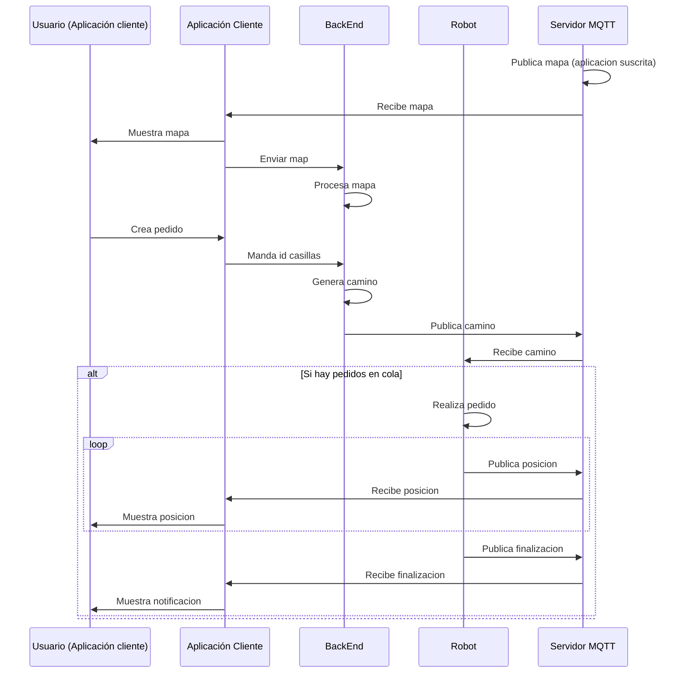

```mermaid
    sequenceDiagram
        participant U as Usuario (Aplicación cliente)
        participant C as Aplicación Cliente
        participant B as BackEnd
        participant R as Robot
        participant S as Servidor MQTT


        S->>S: Publica mapa (aplicacion suscrita)
        S->>C: Recibe mapa
        C->>U: Muestra mapa
        C->>B: Enviar map
        B->>B: Procesa mapa
        U->>C: Crea pedido
        C->>B: Manda id casillas
        B->>B: Genera camino
        B->>S: Publica camino
        S->>R: Recibe camino
        alt Si hay pedidos en cola
        R->>R: Realiza pedido
        loop 
            R->>S: Publica posicion
            S->>C: Recibe posicion
            C->>U: Muestra posicion
        end
        R->>S: Publica finalizacion
        S->>C: Recibe finalizacion
        C->>U: Muestra notificacion
    
        else
            
        end

```